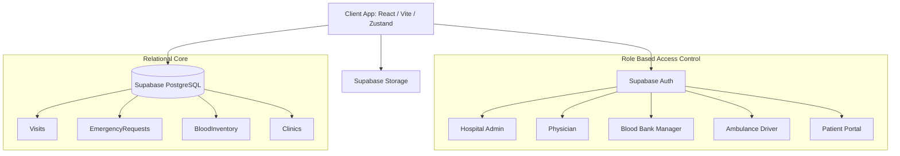

# 🌟 JIVA: The Ultimate Unified Care Platform

  

Welcome to **JIVA**, the most comprehensive, hyper-scalable, and state-of-the-art Clinical Services Ecosystem ever built. We didn't just build an MVP for a hackathon; we engineered a **production-ready, enterprise-tier SaaS platform** designed to revolutionize healthcare administration globally. 

JIVA is an all-in-one ecosystem seamlessly bridging hospitals, blood banks, emergency responders, and patients into a single, high-performance network.

---

## 🎯 The Vision & Problem Statement

The modern healthcare system is fragmented. Small clinics and hospital branches often manage their entire operational workflow using phone calls, notebooks, WhatsApp messages, or disjointed spreadsheets. This chaos leads to severe bottlenecks, especially during emergencies where finding an ambulance or locating a specific blood type is a frantic manual search.

**JIVA eliminates this fragmentation by offering a unified, real-time command center.** 

### The Problem vs. The JIVA Solution

| Problem Area | Traditional Reality | The JIVA Ecosystem Solution |
| :--- | :--- | :--- |
| **Appointments & Patients** | Phone calls, paper diaries, lost records | Top-tier EHR workflows. Receptionists log demographics; Physicians get distraction-free, isolated daily queues. No double-booking. |
| **Emergency Management** | Frantic calls to find drivers, lost ambulances | **Next-Gen Dispatch Desk.** Patients/hospitals drop exact GPS pins. Live fleet tracking board categorizes emergencies by priority (Low to Critical). |
| **Blood Availability** | Calling individual blood banks one by one | **Global Inventory Matrix.** Manage 8 blood groups & components. Cross-match and fulfill life-saving requests instantly with a single click. |
| **Healthcare Facilities** | Relying on word of mouth or generic web searches | Built-in directory of nearby affiliated hospitals, clinics, labs, and pharmacies inside the dedicated Patient Portal. |

---

## 🏗️ System Architecture

JIVA is built on a robust, modern tech stack designed for zero-latency and high reliability.



### Core Technologies
- **Frontend:** React 18, Vite, Tailwind CSS, Zustand (Global State Management)
- **Backend/Database:** Supabase, PostgreSQL (Fully relational schema with strict Foreign Key constraints)
- **UI Components:** Radix UI, Lucide Icons, html2canvas & jsPDF for Reporting

---

## 🔄 Core Data Flows

### Scenario: Emergency Ambulance Dispatch
1. **Initiation:** A Patient (or Hospital Admin) logs into their portal and clicks "Emergency". They fill out their details and hit **"Get Exact GPS"**, automatically populating their geographic coordinates.
2. **Dispatch Board:** The request instantly appears on the Ambulance Driver / Admin dispatch board with a flashing `Critical` status.
3. **Fulfillment:** The Driver clicks "Assign Ambulance". The fleet status transitions from `Available` to `Dispatched`, and the driver receives the exact GPS link to navigate to the scene.

### Scenario: Blood Bank Cross-matching
1. **Request:** A Hospital requires 2 units of `AB-` Plasma. A request is generated in the system.
2. **Matrix View:** The Blood Bank Manager opens the Blood Bank Matrix, views their globally tracked inventory, and selects the matching request.
3. **Fulfillment:** With a single click, the inventory is deducted, the request is marked `Fulfilled`, and the Hospital is instantly notified.

---

## 🚀 Pushing the Boundaries: Enterprise-Ready Features

We went far beyond the hackathon boundaries to deliver a platform that is genuinely ready for industry deployment.

### 1. Unprecedented Multi-Tenant RBAC
Most systems fail due to poor role segregation. JIVA features a frictionless architecture tailored for every stakeholder:

| Role | Exclusive Capabilities & Dashboards |
| :--- | :--- |
| **Hospital Admin** | Total macro-control over facility operations, analytics, staff, and overall appointment queues. |
| **Physician / Doctor** | Clean, distraction-free clinical records, direct patient histories, and clinical PDF reporting. |
| **Receptionist** | Lightning-fast patient intake, scheduling, and queue management. |
| **Blood Bank Manager** | Dedicated, isolated inventory control dashboards and cross-matching tools. |
| **Ambulance Driver** | Streamlined dispatch screens highlighting exact pickup coordinates and fleet status. |
| **Patient** | Self-service portal to view personal reports, book appointments, and trigger SOS emergencies autonomously. |

### 2. Clinical Analytics & One-Click PDF Reporting
JIVA features automated, highly polished PDF report generation. With a single click, physicians can export comprehensive clinical analytics and patient histories. Data-driven dashboards calculate real-time metrics on patient inflow, demographics, and facility utilization.

### 3. State-of-the-Art UX & Reliability
JIVA boasts a **100% functional UI/UX**. Every state change is backed by instant toast alert validations, interactive contextual modals, and buttery-smooth page transitions. There are no broken states; every search bar synchronously filters the database.

---

## ⚙️ How to Run Locally

Follow these steps to launch the entire production-ready ecosystem on your local machine:

1. **Install Dependencies**
   Ensure you have Node.js installed. Open a terminal in this directory and run:
   ```bash
   npm install
   ```

2. **Environment Variables**
   The project connects to a live Supabase instance pre-seeded with all demo data. 
   The required `.env` file must contain:
   ```env
   VITE_SUPABASE_URL=https://kmeovexozdilnclrylwf.supabase.co
   VITE_SUPABASE_ANON_KEY=<provided-anon-key>
   ```

3. **Start the Development Server**
   Run the following command to boot up the application:
   ```bash
   npm run dev
   ```
   The application will be available at `http://localhost:5173`.

### ⚡ Zero-Setup Demo Logins
We have engineered **Zero-Setup Demo Accounts** directly on the Login page. 
You do not need to manually create accounts! Simply click any of the **Demo Logins** (e.g., Hospital Admin, Physician, Ambulance Driver) to instantly jump into that role's fully populated dashboard.

---

## 🌐 Deploying to Vercel

Deploying JIVA to production is a flawless, 2-minute process:

1. **Import the Project:** Log into Vercel and import this GitHub repository.
2. **Framework Preset:** Vercel will automatically detect **Vite**. Leave the Build Command as `npm run build` and the Output Directory as `dist`.
3. **Environment Variables (CRITICAL):** Before clicking deploy, expand the Environment Variables section and add the two variables (`VITE_SUPABASE_URL` and `VITE_SUPABASE_ANON_KEY`) listed above.
4. **Deploy:** Click "Deploy". The platform will be live, fully functional, and connected to the production database instantly.

---
**JIVA: Saving lives, one click at a time.**
